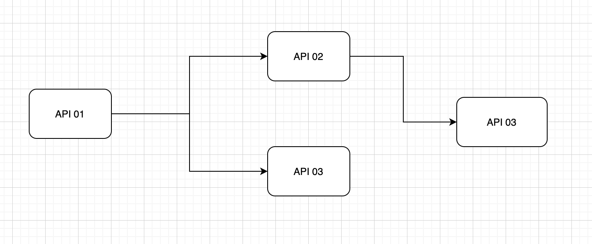
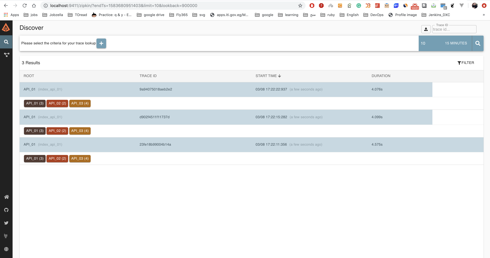
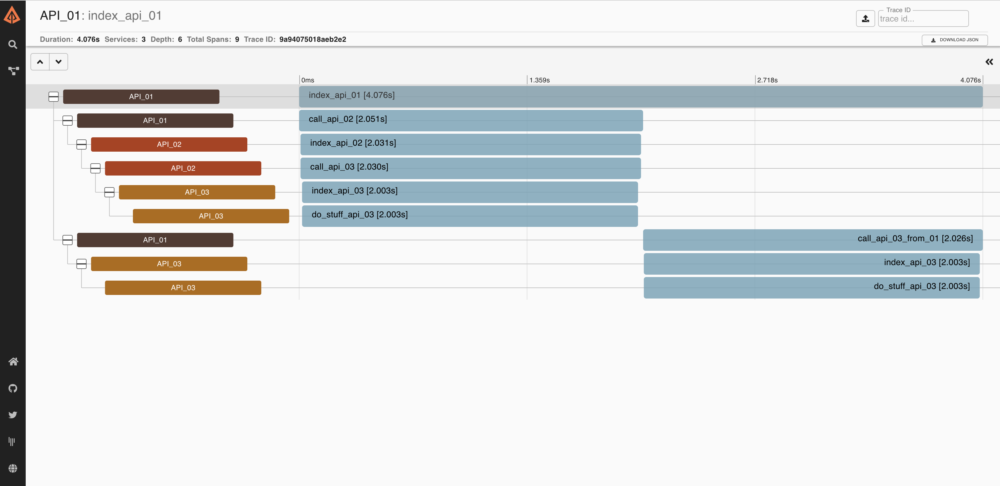

## Used Tools

#### Zipkin

Zipkin is a distributed tracing system. Using Zipkin will make you able to see all the services that a request goes through, determine the duration time needed for each service.

##### What is a distributed tracing system:

From [OpenTracing website](https://opentracing.io/docs/overview/what-is-tracing/):
Distributed tracing, also called distributed request tracing, is a method used to profile and monitor applications, especially those built using a microservices architecture. Distributed tracing helps pinpoint where failures occur and what causes poor performance.

#### Flask

Flask is a lightweight WSGI framework. It is one of the most popular Python frameworks.
Here is their [documentation](https://flask.palletsprojects.com/en/1.1.x/quickstart/).

#### py_zipkin

py_zipkin provides a context manager/decorator along with some utilities to facilitate the usage of Zipkin in Python applications. 
You can read more about it [here](https://github.com/Yelp/py_zipkin)

We use py_zipkin here as the application is a Python app. If you are interested in other languages, you can find a list of supported tracers by Zipkin [here](https://zipkin.io/pages/tracers_instrumentation.html)

#### Docker Compose

Docker Compose is a tool that you can use to define and run multi docker containers. You use a YAML file to define all services and with just one command you can start them all.
To learn more about Compose, see their [documentation](https://docs.docker.com/compose/).


## Run the demo

### Start The Containers:

To start the containers run the following command:

``` docker-compose up --build ```

Visit the api_01's URL [ http://localhost:5001 ]


#### The request flow:

As shown in the following image, api_01 will send two requests, one to api_02 and the other to api_03. api_02 will send a request to api_03.



To see this on Zipkin, visit Zipkin's URL [ http://localhost:9411/zipkin ] then click on the search button to get traces saved.




Select a trace from the list.



The request's trace.As you can see from the previous image, api_01 made 2 requests 'to api_02 and api_03'. Also, api_02 made a request to 'api_03'
Each row here represents a span. You can create spans whenever it is needed.

